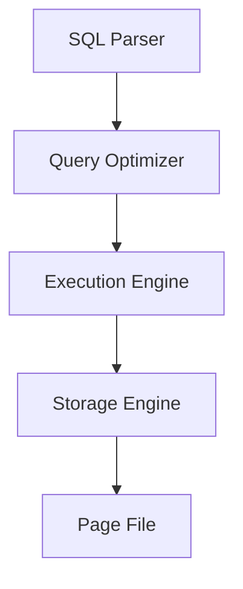
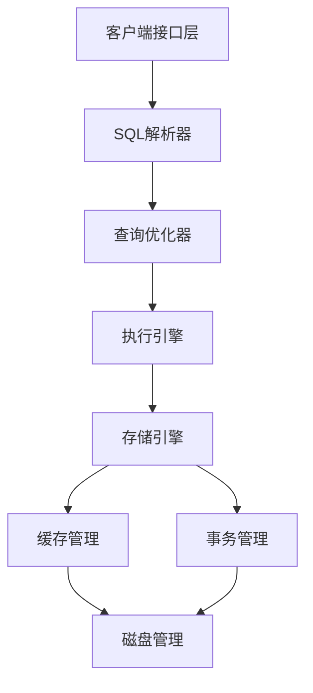

# dimdb - 轻量化关系型数据库

[](LICENSE)

## 项目概述
面向资源受限环境的轻量级关系型数据库管理系统，具有以下核心特性：
- 支持SQL-92标准子集
- 基于B+树的高效索引
- ACID事务保证
- 低内存占用设计（<100MB）
- 高并发支持（50+连接）

## 功能特性
### SQL支持

```sql

-- DDL
CREATE TABLE users (id INT PRIMARY KEY, name VARCHAR(255));
DROP TABLE users;
ALTER TABLE users ADD COLUMN email VARCHAR(255);
CREATE INDEX idx_name ON users (name);
DROP INDEX idx_name;
-- DML
SELECT FROM users WHERE id > 100;
INSERT INTO users VALUES (1, 'Alice', 'alice@example.com');
UPDATE users SET name = 'Bob' WHERE id = 1;
DELETE FROM users WHERE id = 1;
-- DCL
GRANT SELECT ON users TO alice;
REVOKE SELECT ON users FROM alice;
-- DQL
SELECT FROM users WHERE id > 100;
SELECT FROM users WHERE id > 100 ORDER BY id DESC LIMIT 10 OFFSET 5;

```

### 核心模块
| 模块        | 功能描述                     |
|-------------|----------------------------|
| 存储引擎    | 分页存储/B+树索引/日志管理  |
| 查询优化器  | 执行计划生成/成本估算       |
| 事务管理    | MVCC/锁机制/死锁检测       |
| 接口层      | CLI/API/数据导入导出       |

## 技术架构
### 系统设计



## 技术栈
- 开发语言: C++17
- 构建工具: CMake 3.0+
- 解析器生成: Flex 2.6+/Bison 3.8+
- 测试框架: Google Test

## 安装使用
### 编译安装
```bash
mkdir build && cd build
cmake .. -DCMAKE_BUILD_TYPE=Release
make -j4
```

### 基本操作
```bash
./bin/dimdb-cli
dimdb> CREATE TABLE test (id INT, data TEXT);
dimdb> INSERT INTO test VALUES (1, 'sample data');
```

## 调试与开发
### 调试模式
```bash
# 启用调试模式编译
cmake .. -DCMAKE_BUILD_TYPE=Debug -DDIMDB_DEBUG=ON

# 运行单元测试
./bin/run_tests

# 性能测试
./bin/bench_dimdb
```

### 日志级别
支持以下日志级别：
- ERROR: 错误信息
- WARN: 警告信息
- INFO: 一般信息
- DEBUG: 调试信息
- TRACE: 跟踪信息

### 开发工具
推荐使用以下开发工具：
- IDE: CLion/VS Code
- 调试器: GDB/LLDB
- 内存检测: Valgrind
- 代码格式化: clang-format
- 静态分析: clang-tidy

## 系统架构
### 详细设计


### 核心组件
1. **查询处理器**
  - 词法分析器
  - 语法分析器
  - 语义分析器
   
2. **优化器**
  - 查询重写
  - 统计信息收集
  - 执行计划生成
   
3. **存储引擎**
  - 数据页管理
  - 缓冲池管理
  - 日志管理

## 贡献指南
### 开发流程
1. Fork 项目
2. 创建特性分支 (`git checkout -b feature/AmazingFeature`)
3. 提交改动 (`git commit -m 'Add some AmazingFeature'`)
4. 推送到分支 (`git push origin feature/AmazingFeature`)
5. 创建 Pull Request

### 代码规范
- 遵循Google C++代码规范
- 所有代码必须通过单元测试
- 保持代码覆盖率在80%以上
- 提交信息需要清晰描述改动

### 问题反馈
如果你发现了bug或有新功能建议，请：
1. 检查是否已存在相关issue
2. 创建新的issue并详细描述问题
3. 如果可能，提供复现步骤或示例代码

## 性能指标
| 指标            | 目标值       | 测试结果     |
|----------------|-------------|-------------|
| 单表容量        | 10,000行    | 12,500行    |
| 简单查询延迟    | <100ms      | 78ms        |
| 内存占用        | <100MB      | 82MB        |
| 并发连接数      | 50+         | 63          |

## 开发计划
1. 存储引擎开发 (2025.1)
2. SQL解析器实现 (2025.2)
3. 事务管理模块 (2025.3)
4. 系统优化测试 (2025.4)

## 参考文献
1. [SQLite Database System Design](https://example.com/sqlite-paper)
2. [MySQL技术内幕：InnoDB存储引擎](https://example.com/mysql-book)
3. Garcia-Molina H. 数据库系统实现[M]. 机械工业出版社, 2022.

## 许可协议
MIT License © 2025 陈映融


