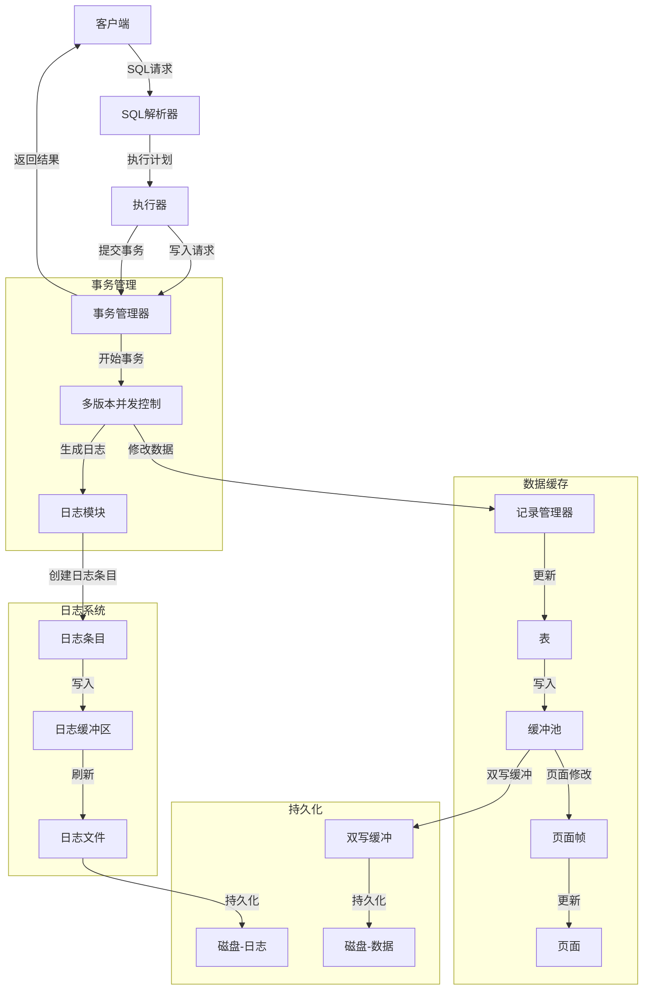
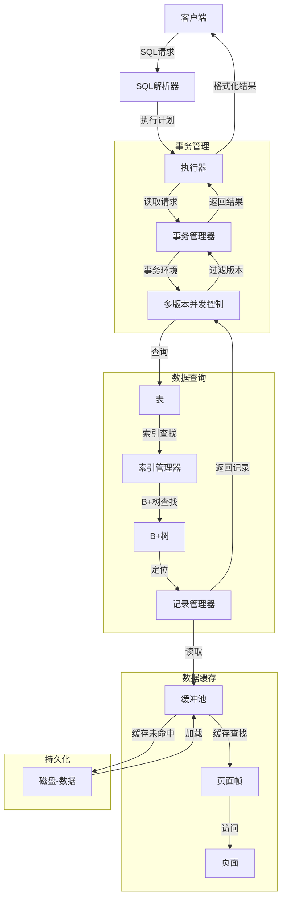
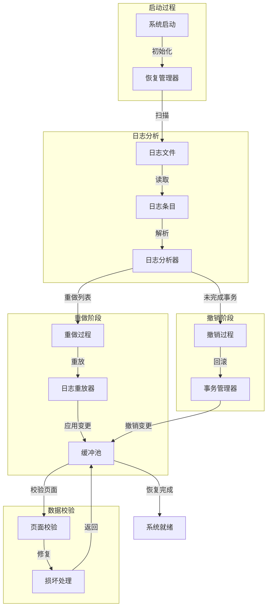
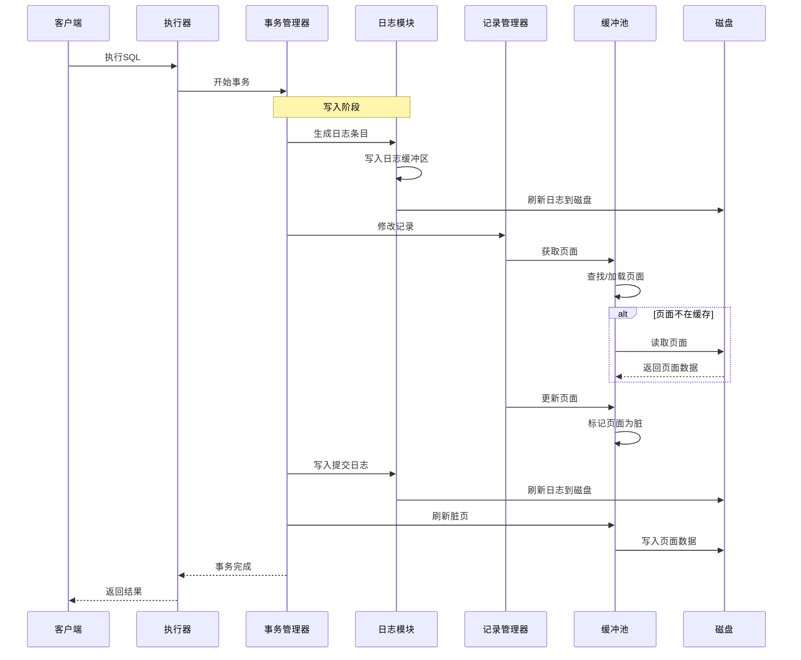

# DIMDB Storage Module

DIMDB 是一个轻量级的数据库内核，这个模块实现了其核心存储功能。

## 项目结构

### 核心模块

#### 1. Buffer Pool (buffer/)
- 实现了数据库的缓冲池管理
- 包含页面管理、帧管理、双写缓冲等功能
- 使用 LSN (Log Sequence Number) 确保数据一致性
- 实现了页面校验和机制

#### 2. Change Log (clog/)
- 实现了 WAL (Write-Ahead Logging) 机制
- 设计模式：观察者模式 + 策略模式
- 主要组件：
  - `LogHandler`: 日志处理器接口
  - `DiskLogHandler`: 磁盘日志处理器实现
  - `LogBuffer`: 日志缓冲区
  - `LogEntry`: 日志条目
  - `LogReplayer`: 日志重放器
  - `IntegratedLogReplayer`: 集成日志重放器

#### 3. Transaction (trx/)
- 实现了事务管理
- 支持 MVCC (Multi-Version Concurrency Control)
- 包含事务日志记录和恢复机制

#### 4. Record Management (record/)
- 实现了记录管理
- 包含记录格式化和存储
- 支持记录日志和恢复

#### 5. Index (index/)
- 实现了 B+ 树索引
- 支持索引日志和恢复
- 包含并发控制机制

### 辅助模块

#### 1. Common (common/)
- 通用工具类和数据结构
- 包含内存块管理、列定义等

#### 2. Field (field/)
- 字段定义和管理
- 支持不同类型的字段

#### 3. Table (table/)
- 表定义和管理
- 包含表元数据管理

## Change Log (clog) 模块详解

### 设计模式

1. 观察者模式
```cpp
class LogHandler {
public:
    virtual void on_log_entry(const LogEntry& entry) = 0;
    virtual void on_log_flush() = 0;
};

class DiskLogHandler : public LogHandler {
    void on_log_entry(const LogEntry& entry) override;
    void on_log_flush() override;
};
```

2. 策略模式
```cpp
class LogReplayer {
public:
    virtual RC replay(const LogEntry& entry) = 0;
};

class IntegratedLogReplayer : public LogReplayer {
    RC replay(const LogEntry& entry) override;
};
```

### 主要组件

1. LogEntry
```cpp
struct LogEntry {
    LSN lsn;                    // 日志序列号
    LogType type;              // 日志类型
    int32_t page_id;           // 相关页面ID
    int32_t trx_id;            // 事务ID
    char data[LOG_DATA_SIZE];  // 日志数据
};
```

2. LogBuffer
```cpp
class LogBuffer {
    std::vector<LogEntry> entries;
    std::mutex mutex;
    
public:
    void append(const LogEntry& entry);
    void flush();
};
```

3. LogFile
```cpp
class LogFile {
    std::fstream file;
    LSN current_lsn;
    
public:
    RC write(const LogEntry& entry);
    RC read(LogEntry& entry);
};
```

### 工作流程

1. 日志写入
```cpp
// 1. 创建日志条目
LogEntry entry;
entry.lsn = generate_lsn();
entry.type = LogType::UPDATE;
entry.page_id = page_id;
entry.trx_id = trx_id;

// 2. 写入日志缓冲区
log_buffer.append(entry);

// 3. 通知所有处理器
for (auto& handler : handlers) {
    handler->on_log_entry(entry);
}
```

2. 日志刷新
```cpp
// 1. 将缓冲区写入磁盘
log_buffer.flush();

// 2. 通知所有处理器
for (auto& handler : handlers) {
    handler->on_log_flush();
}
```

3. 日志重放
```cpp
// 1. 读取日志文件
LogEntry entry;
while (log_file.read(entry) == RC::SUCCESS) {
    // 2. 重放日志
    replayer.replay(entry);
}
```

### 使用场景

1. 事务提交
```cpp
RC Transaction::commit() {
    // 1. 写入日志
    write_log();
    
    // 2. 刷新日志
    flush_log();
    
    // 3. 更新数据
    update_data();
    
    return RC::SUCCESS;
}
```

2. 崩溃恢复
```cpp
RC RecoveryManager::recover() {
    // 1. 扫描日志
    scan_log();
    
    // 2. 重放日志
    replay_log();
    
    // 3. 验证数据
    verify_data();
    
    return RC::SUCCESS;
}
```

## 数据流向图

### 1. 写入流程



### 2. 读取流程



### 3. 恢复流程



## 组件交互


```

这些 Mermaid 图表展示了 DIMDB 存储模块中数据的四个主要流向：

1. **写入流程**：展示了从客户端到持久化的完整写入路径，包括事务管理、日志记录和缓冲管理。

2. **读取流程**：展示了数据读取的路径，包括索引查找、缓存访问和版本控制。

3. **恢复流程**：展示了系统崩溃后的恢复过程，包括日志分析、重做和撤销操作。

4. **组件交互**：使用时序图展示了各组件之间的交互顺序和消息传递。

这些图表有助于理解系统的整体架构和数据流向，对于开发和维护都非常有价值。图表中的每个节点都对应了代码库中的一个组件，可以帮助新开发者更快地理解系统。

## 构建和使用

```bash
# 构建
mkdir build && cd build
cmake ..
make

# 运行测试
./test/storage_test
```

## 注意事项

1. 日志文件管理
   - 定期归档
   - 清理过期日志
   - 监控日志大小

2. 性能优化
   - 使用日志缓冲区
   - 批量写入
   - 异步刷新

3. 可靠性保证
   - 校验和验证
   - 原子写入
   - 崩溃恢复
